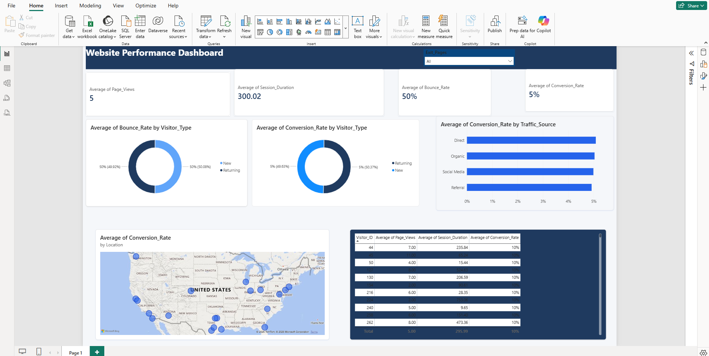

# 📊 Website Performance Dashboard

An interactive and professional Power BI dashboard built to analyze website performance metrics, visitor behavior, traffic sources, and conversion insights using dynamic visualizations and KPI indicators.

---

# 🚀 Project Overview

This project focuses on understanding website performance through key analytics metrics such as:

- Page Views
- Session Duration
- Bounce Rate
- Conversion Rate
- Traffic Sources
- Visitor Types
- Geographic Performance

The dashboard helps identify user behavior trends and supports data-driven decision-making for improving website performance and conversion optimization.

---

# 🛠️ Tools & Technologies Used

- 📈 Microsoft Power BI
- 📄 CSV Dataset
- 📊 Data Visualization
- 📍 Map Analytics
- 🎨 Dashboard Design & Formatting

---

# 📂 Dataset Information

Dataset used:
```text
website_performance_analytics.csv
```

### Dataset Columns

| Column Name | Description |
|---|---|
| Visitor_ID | Unique visitor identifier |
| Page_Views | Number of pages viewed |
| Session_Duration | Duration of session |
| Bounce_Rate | Percentage of visitors leaving after one page |
| Conversion_Rate | Percentage of successful conversions |
| Traffic_Source | Source of website traffic |
| Exit_Pages | Pages where users exited |
| Load_Time | Webpage loading time |
| Visitor_Type | New or Returning visitor |
| Location | Visitor geographic location |

---

# 📌 Dashboard Features

## ✅ KPI Cards
The dashboard includes KPI cards displaying:
- Average Page Views
- Average Session Duration
- Average Bounce Rate
- Average Conversion Rate

---

## 🍩 Donut Charts
Two donut charts visualize:
- Average Bounce Rate by Visitor Type
- Average Conversion Rate by Visitor Type

---

## 📊 Traffic Source Analysis
A bar chart displays:
- Average Conversion Rate by Traffic Source

This helps identify the most effective traffic channels.

---

## 🗺️ Geographic Insights
A map visualization shows:
- Average Conversion Rate by Location

This provides regional performance analysis.

---

## 📋 Visitor Performance Table
The dashboard includes a detailed table containing:
- Visitor_ID
- Average Page Views
- Average Session Duration
- Average Conversion Rate

Additional enhancements:
- Top 100 Visitors filter
- Descending Conversion Rate sorting
- Conditional formatting for better insights

---

# 🎨 Dashboard Design Highlights

- Professional dark blue theme
- Interactive slicers and filters
- Consistent visual styling
- Conditional formatting
- Modern dashboard layout

---

# 📸 Dashboard Preview

## Main Dashboard



---

# 📈 Key Insights

- Returning visitors showed different engagement patterns compared to new visitors.
- Certain traffic sources generated higher conversion rates.
- Geographic analysis identified regions with stronger conversion performance.
- Conditional formatting improved quick identification of high-performing visitors.

---

# 📁 Project Structure

```text
Website-Performance-Dashboard/
│
├── Website_Performance_Dashboard.pbix
├── website_performance_analytics.csv
├── dashboard_screenshot.png
└── README.md
```

---

# ▶️ How to Use

1. Download the repository
2. Open `.pbix` file using Power BI Desktop
3. Explore filters, charts, and interactive visuals
4. Analyze visitor and conversion trends

---

# 🎯 Learning Outcomes

Through this project, I learned:
- Power BI dashboard development
- Data cleaning and formatting
- KPI visualization
- Interactive reporting
- Conditional formatting
- Dashboard UI/UX design

---

# 📬 Author

Developed by: Navneet Pal

---

# ⭐ If You Like This Project

Feel free to:
- Star the repository ⭐
- Fork the project 🍴
- Share feedback 💬
